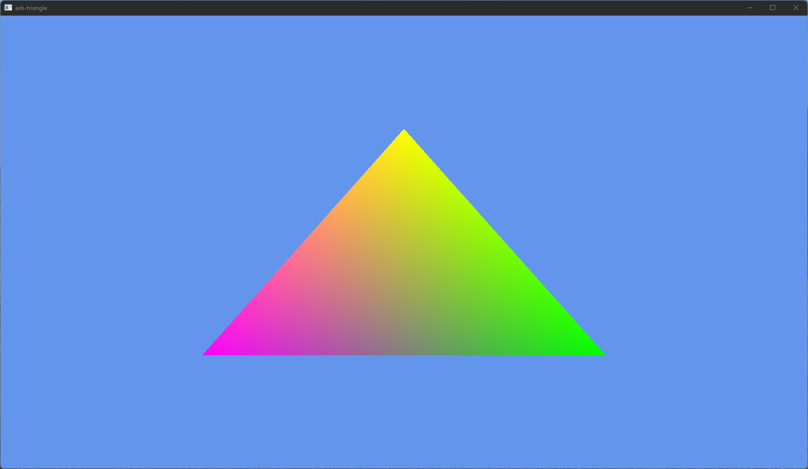

<!-- markdownlint-disable-file MD041 -->
<!-- markdownlint-disable-file MD033 -->

# `🔺vk-ash-triangle`

**A simple vulkan triangle using ash, dynamic rendering & synchronization 2 🦀**

I uploaded this so Vulkan Beginners have a little example :)

[![license][license-badge]][license-url]
[![dependency-status][dependency-badge]][dependency-url]

[license-badge]: https://img.shields.io/badge/License-Apache_2.0-blue.svg
[license-url]: LICENSE

[dependency-badge]: https://deps.rs/repo/github/projectkml/vk-ash-triangle/status.svg
[dependency-url]: https://deps.rs/repo/github/projectkml/vk-ash-triangle

